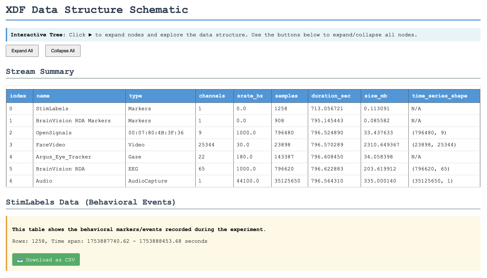

# XDF Data Extraction and Visualization Tool

A Python utility for examining and extracting data from XDF (Extensible Data Format) files recorded from Lab Streaming Layer (LSL) servers. This tool is designed for task builders and programmers who need to inspect metadata, explore data structures, and extract behavioral event streams from multi-modal LSL recordings.

## Overview

When developing tasks that stream data to LSL, you often need to verify that your data is being recorded correctly. This tool helps you:

- **Explore XDF file structure** with an interactive, collapsible HTML tree view
- **Examine metadata** for all recorded channels/streams
- **Identify and extract behavioral data streams** (markers, events, triggers, stimuli)
- **Export behavioral events** to CSV for analysis
- **Verify data integrity** by inspecting timestamps, sample counts, and data ranges

## Features

- **Automatic behavioral stream detection** - Finds common marker streams (StimLabels, Markers, Events, Triggers)
- **Interactive HTML visualization** - Browse your data structure with expandable/collapsible nodes
- **Stream summary tables** - Quick overview of all recorded streams with key metadata
- **Behavioral data extraction** - Export event markers with precise timestamps
- **Multi-feature support** - Handles streams with multiple columns/features
- **Memory-efficient** - Reports data sizes to help optimize your LSL configurations

## Installation

```bash
pip install -r requirements.txt
```

Requirements:
- Python 3.7+
- numpy
- pandas
- pyxdf

## Quick Start

### Basic Usage (Auto-detect behavioral stream)

```bash
python xdf_extraction.py data.xdf
```

This will generate:
- `xdf_schematic.html` - Interactive visualization
- `xdf_schematic_behavioral_data.csv` - Extracted behavioral events

### Specify Behavioral Stream Name

If your behavioral stream has a specific name (e.g., "TaskMarkers", "PsychoPyEvents"):

```bash
python xdf_extraction.py data.xdf -b "TaskMarkers"
```

### Custom Output Files

```bash
python xdf_extraction.py data.xdf -o my_experiment
```

Generates:
- `my_experiment.html`
- `my_experiment_behavioral_data.csv`

### Advanced Options

```bash
# Increase tree depth for deep data structures
python xdf_extraction.py data.xdf -d 10

# Skip CSV export (HTML only)
python xdf_extraction.py data.xdf --no-csv

# Combine options
python xdf_extraction.py data.xdf -b "Markers" -o session01 -d 8
```

## Command-Line Options

```
positional arguments:
  xdf_file              Path to XDF file to visualize

optional arguments:
  -h, --help            Show help message
  -o, --output OUTPUT   Output file stem without extension (default: xdf_schematic)
  -d, --max-depth DEPTH Maximum tree depth to display (default: 6)
  -b, --behavioral-stream NAME
                        Name of behavioral stream to prioritize
  --no-csv              Skip saving behavioral data as CSV
```

## Example Output



*Example of the interactive HTML visualization showing stream summary and behavioral data*

## Use Cases for Task Builders

### 1. Verify LSL Stream Configuration

After setting up your task to stream data to LSL, use this tool to verify:

- **Channel counts** match your configuration
- **Sampling rates** are correct
- **Stream names** are descriptive and unique
- **Data types** are appropriate (e.g., string markers for events, float64 for physiological data)

```python
# Example: Check if your 8-channel EEG stream was recorded correctly
python xdf_extraction.py pilot_session.xdf
# Look in the Stream Summary table for:
# - name: "YourEEGDevice"
# - channels: 8
# - srate_hz: 250.0
```

### 2. Debug Event Timing

Extract behavioral markers to verify timing accuracy:

```bash
python xdf_extraction.py experiment.xdf -b "PsychoPyMarkers"
```

Open the CSV file to inspect:
- Event onset timestamps
- Inter-stimulus intervals
- Trial sequences
- Response timing

### 3. Inspect Multi-Feature Streams

If your behavioral stream includes multiple columns (e.g., event type, stimulus ID, response):

```bash
python xdf_extraction.py data.xdf -b "TaskEvents"
```

The tool automatically detects and labels multiple features as `feature_0`, `feature_1`, etc.

### 4. Compare Streams Across Sessions

Generate reports for multiple sessions to ensure consistency:

```bash
python xdf_extraction.py session1.xdf -o session1_report
python xdf_extraction.py session2.xdf -o session2_report
# Compare the Stream Summary tables in both HTML files
```

## Understanding the Output

### Stream Summary Table

The HTML file includes a summary table with these columns:

- **index**: Stream index in the XDF file
- **name**: Stream name (as defined in LSL)
- **type**: Data type (e.g., "Markers", "EEG", "PPG")
- **channels**: Number of channels
- **srate_hz**: Nominal sampling rate in Hz (0 = irregular)
- **samples**: Total number of samples recorded
- **duration_sec**: Recording duration in seconds
- **size_mb**: Approximate memory footprint
- **time_series_shape**: Dimensions of the data array

### Behavioral Data CSV

Extracted CSV files contain:

- **sample_index**: Sequential sample number
- **time_series** or **feature_N**: Event markers/data
- **time_stamp**: LSL timestamp in seconds

### Interactive Tree View

The HTML visualization shows the complete XDF data structure:

- Click **�** to expand nodes
- Use **Expand All/Collapse All** buttons for quick navigation
- Behavioral stream is highlighted and prioritized
- Color-coded information:
  - **Red**: Data types
  - **Green**: Value summaries
  - **Gray**: Sizes in MB

## Programmatic Usage

You can also use this tool as a Python library:

```python
import pyxdf
from xdf_extraction import XDFSchematicGenerator

# Load XDF file
streams, header = pyxdf.load_xdf('data.xdf')

# Create generator
generator = XDFSchematicGenerator(
    streams,
    header,
    behavioral_stream_name="MyMarkers"  # Optional
)

# Get stream summary
summary_df = generator.generate_summary_table()
print(summary_df)

# Extract behavioral data
behavioral_df = generator.get_behavioral_data()
print(behavioral_df.head())

# Generate interactive visualization
generator.generate_interactive_html(
    max_depth=6,
    output_file='my_output.html',
    save_behavioral_csv=True
)
```

## Common LSL Stream Names

The tool auto-detects these common behavioral stream names:

- `stimlabels` / `StimLabels`
- `markers` / `Markers`
- `events` / `Events`
- `triggers` / `Triggers`
- `behavioral` / `Behavioral`

If your stream doesn't match these, use the `-b` flag to specify it.

## Troubleshooting

### "No behavioral stream found"

**Solution**: Use the `-b` flag to specify your stream name exactly as it appears in LSL:

```bash
python xdf_extraction.py data.xdf -b "YourStreamName"
```

Check the warning message for a list of available streams.

### Empty CSV file

**Possible causes**:
- Behavioral stream has no data (`time_series` is empty)
- Stream was opened but never received data
- Check the Stream Summary table for `samples: 0`

### "pyxdf is required" error

**Solution**:
```bash
pip install pyxdf
```

### Very large HTML files

**Solution**: Reduce tree depth:
```bash
python xdf_extraction.py data.xdf -d 4
```

## Tips for LSL Task Development

1. **Use descriptive stream names** - Make streams easy to identify (e.g., "ExperimentMarkers" not "Stream1")

2. **Set appropriate sampling rates** - Use 0 Hz for irregular event streams, exact rates for continuous data

3. **Include metadata** - LSL allows custom metadata in the stream info; this tool will display it

4. **Test early** - Record a short test session and verify structure before full data collection

5. **Document your streams** - Use the generated HTML as documentation for your task's data format

## Contributing

This tool was designed for LSL task builders. If you encounter issues with specific XDF structures or have feature requests, please provide:

- Sample XDF file (if possible)
- Description of your LSL streaming setup
- Expected vs. actual behavior

## License

GNU GENERAL PUBLIC LICENSE V3

## See Also

- [Lab Streaming Layer Documentation](https://labstreaminglayer.readthedocs.io/)
- [pyxdf Documentation](https://github.com/xdf-modules/pyxdf)
- [XDF File Format Specification](https://github.com/sccn/xdf/wiki/Specifications)
